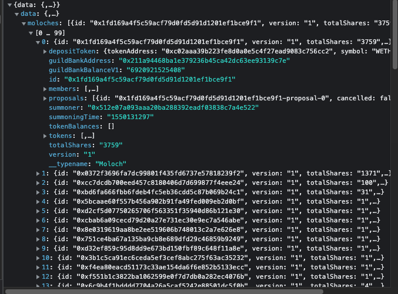

```typescript
////////////            API            ////////////
const request_dao_list = fetch("https://api.thegraph.com/subgraphs/name/odyssy-automaton/daohaus", {
  "headers": {
    "accept": "*/*",
    "accept-language": "zh-CN,zh;q=0.9,en-US;q=0.8,en;q=0.7,zh-TW;q=0.6",
    "content-type": "application/json",
    "sec-ch-ua": "\" Not A;Brand\";v=\"99\", \"Chromium\";v=\"101\", \"Google Chrome\";v=\"101\"",
    "sec-ch-ua-mobile": "?1",
    "sec-ch-ua-platform": "\"Android\"",
    "sec-fetch-dest": "empty",
    "sec-fetch-mode": "cors",
    "sec-fetch-site": "cross-site"
  },
  "referrer": "https://app.daohaus.club/",
  "referrerPolicy": "strict-origin-when-cross-origin",
  "body": "{\"operationName\":\"moloches\",\"variables\":{\"skip\":0},\"query\":\"query moloches($skip: Int) {\\n  moloches(orderBy: summoningTime, first: 1000, skip: $skip) {\\n    id\\n    version\\n    totalShares\\n    guildBankAddress\\n    summoningTime\\n    summoner\\n    guildBankBalanceV1\\n    members(where: {exists: true}) {\\n      id\\n      __typename\\n    }\\n    proposals {\\n      id\\n      cancelled\\n      createdAt\\n      details\\n      didPass\\n      lootRequested\\n      processed\\n      sharesRequested\\n      tributeOffered\\n      tributeToken\\n      __typename\\n    }\\n    tokens {\\n      id\\n      __typename\\n    }\\n    depositToken {\\n      tokenAddress\\n      symbol\\n      decimals\\n      __typename\\n    }\\n    tokenBalances(where: {guildBank: true}) {\\n      id\\n      tokenBalance\\n      guildBank\\n      token {\\n        decimals\\n        tokenAddress\\n        __typename\\n      }\\n      __typename\\n    }\\n    __typename\\n  }\\n}\\n\"}",
  "method": "POST",
  "mode": "cors",
  "credentials": "omit"
});

const respond_dao_list = "看下图"
```



```typescript

////////////            Example            ////////////

const request_dao_list_1 = fetch("https://api.thegraph.com/subgraphs/name/odyssy-automaton/daohaus", {
  "headers": {
    "accept": "*/*",
    "accept-language": "zh-CN,zh;q=0.9,en-US;q=0.8,en;q=0.7,zh-TW;q=0.6",
    "content-type": "application/json",
    "sec-ch-ua": "\" Not A;Brand\";v=\"99\", \"Chromium\";v=\"101\", \"Google Chrome\";v=\"101\"",
    "sec-ch-ua-mobile": "?1",
    "sec-ch-ua-platform": "\"Android\"",
    "sec-fetch-dest": "empty",
    "sec-fetch-mode": "cors",
    "sec-fetch-site": "cross-site"
  },
  "referrer": "https://app.daohaus.club/",
  "referrerPolicy": "strict-origin-when-cross-origin",
  "body": "{\"operationName\":\"moloches\",\"variables\":{\"skip\":0},\"query\":\"query moloches($skip: Int) {\\n  moloches(orderBy: summoningTime, first: 1000, skip: $skip) {\\n    id\\n    version\\n    totalShares\\n    guildBankAddress\\n    summoningTime\\n    summoner\\n    guildBankBalanceV1\\n    members(where: {exists: true}) {\\n      id\\n      __typename\\n    }\\n    proposals {\\n      id\\n      cancelled\\n      createdAt\\n      details\\n      didPass\\n      lootRequested\\n      processed\\n      sharesRequested\\n      tributeOffered\\n      tributeToken\\n      __typename\\n    }\\n    tokens {\\n      id\\n      __typename\\n    }\\n    depositToken {\\n      tokenAddress\\n      symbol\\n      decimals\\n      __typename\\n    }\\n    tokenBalances(where: {guildBank: true}) {\\n      id\\n      tokenBalance\\n      guildBank\\n      token {\\n        decimals\\n        tokenAddress\\n        __typename\\n      }\\n      __typename\\n    }\\n    __typename\\n  }\\n}\\n\"}",
  "method": "POST",
  "mode": "cors",
  "credentials": "omit"
});

const respond_dao_list_1 = "看下图"
```


