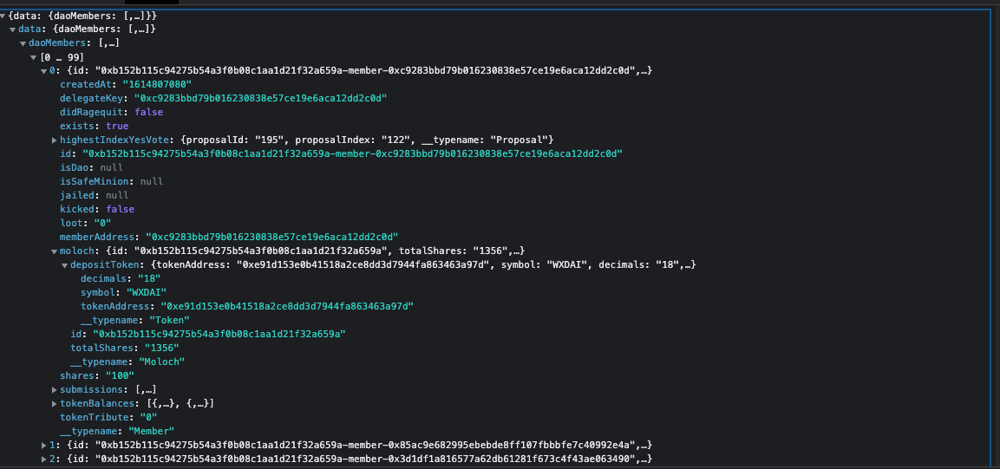

```typescript
////////////            API            ////////////    
const request_dao_memeber = fetch("https://api.thegraph.com/subgraphs/name/odyssy-automaton/daohaus-xdai", {
    "headers": {
      "accept": "*/*",
      "accept-language": "zh-CN,zh;q=0.9,en-US;q=0.8,en;q=0.7,zh-TW;q=0.6",
      "content-type": "application/json",
      "sec-ch-ua": "\" Not A;Brand\";v=\"99\", \"Chromium\";v=\"101\", \"Google Chrome\";v=\"101\"",
      "sec-ch-ua-mobile": "?1",
      "sec-ch-ua-platform": "\"Android\"",
      "sec-fetch-dest": "empty",
      "sec-fetch-mode": "cors",
      "sec-fetch-site": "cross-site"
    },
    "referrer": "https://app.daohaus.club/",
    "referrerPolicy": "strict-origin-when-cross-origin",
    "body": "{\"operationName\":\"membersList\",\"variables\":{\"contractAddr\":\"合约地址\",\"skip\":0},\"query\":\"query membersList($contractAddr: String!, $skip: Int) {\\n  daoMembers: members(\\n    where: {molochAddress: $contractAddr}\\n    orderBy: shares\\n    orderDirection: desc\\n    first: 1000\\n    skip: $skip\\n  ) {\\n    id\\n    delegateKey\\n    shares\\n    loot\\n    kicked\\n    jailed\\n    tokenTribute\\n    didRagequit\\n    memberAddress\\n    exists\\n    createdAt\\n    isDao {\\n      id\\n      __typename\\n    }\\n    isSafeMinion {\\n      id\\n      minions {\\n        minionAddress\\n        molochAddress\\n        __typename\\n      }\\n      __typename\\n    }\\n    moloch {\\n      id\\n      totalShares\\n      depositToken {\\n        tokenAddress\\n        symbol\\n        decimals\\n        __typename\\n      }\\n      __typename\\n    }\\n    highestIndexYesVote {\\n      proposalId\\n      proposalIndex\\n      __typename\\n    }\\n    tokenBalances {\\n      id\\n      tokenBalance\\n      token {\\n        id\\n        tokenAddress\\n        symbol\\n        decimals\\n        __typename\\n      }\\n      __typename\\n    }\\n    submissions {\\n      id\\n      proposalIndex\\n      yesVotes\\n      noVotes\\n      processed\\n      didPass\\n      cancelled\\n      __typename\\n    }\\n    __typename\\n  }\\n}\\n\"}",
    "method": "POST",
    "mode": "cors",
    "credentials": "omit"
  });

const respond_dao_memeber = "看下图"
```



```typescript
////////////            Example            ////////////    

const request_dao_memeber_1 = fetch("https://api.thegraph.com/subgraphs/name/odyssy-automaton/daohaus-xdai", {
    "headers": {
      "accept": "*/*",
      "accept-language": "zh-CN,zh;q=0.9,en-US;q=0.8,en;q=0.7,zh-TW;q=0.6",
      "content-type": "application/json",
      "sec-ch-ua": "\" Not A;Brand\";v=\"99\", \"Chromium\";v=\"101\", \"Google Chrome\";v=\"101\"",
      "sec-ch-ua-mobile": "?1",
      "sec-ch-ua-platform": "\"Android\"",
      "sec-fetch-dest": "empty",
      "sec-fetch-mode": "cors",
      "sec-fetch-site": "cross-site"
    },
    "referrer": "https://app.daohaus.club/",
    "referrerPolicy": "strict-origin-when-cross-origin",
    "body": "{\"operationName\":\"membersList\",\"variables\":{\"contractAddr\":\"0xb152b115c94275b54a3f0b08c1aa1d21f32a659a\",\"skip\":0},\"query\":\"query membersList($contractAddr: String!, $skip: Int) {\\n  daoMembers: members(\\n    where: {molochAddress: $contractAddr}\\n    orderBy: shares\\n    orderDirection: desc\\n    first: 1000\\n    skip: $skip\\n  ) {\\n    id\\n    delegateKey\\n    shares\\n    loot\\n    kicked\\n    jailed\\n    tokenTribute\\n    didRagequit\\n    memberAddress\\n    exists\\n    createdAt\\n    isDao {\\n      id\\n      __typename\\n    }\\n    isSafeMinion {\\n      id\\n      minions {\\n        minionAddress\\n        molochAddress\\n        __typename\\n      }\\n      __typename\\n    }\\n    moloch {\\n      id\\n      totalShares\\n      depositToken {\\n        tokenAddress\\n        symbol\\n        decimals\\n        __typename\\n      }\\n      __typename\\n    }\\n    highestIndexYesVote {\\n      proposalId\\n      proposalIndex\\n      __typename\\n    }\\n    tokenBalances {\\n      id\\n      tokenBalance\\n      token {\\n        id\\n        tokenAddress\\n        symbol\\n        decimals\\n        __typename\\n      }\\n      __typename\\n    }\\n    submissions {\\n      id\\n      proposalIndex\\n      yesVotes\\n      noVotes\\n      processed\\n      didPass\\n      cancelled\\n      __typename\\n    }\\n    __typename\\n  }\\n}\\n\"}",
    "method": "POST",
    "mode": "cors",
    "credentials": "omit"
  });
const respond_dao_memeber_1 = "看下图"
```


