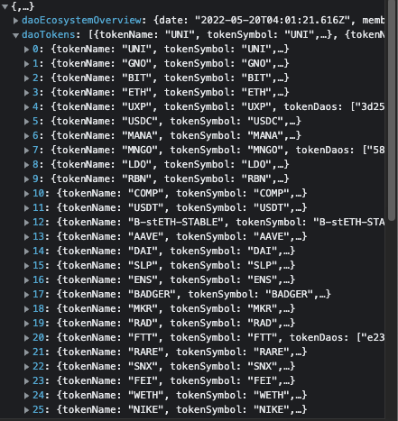

```typescript
////////////            API            ////////////
const request_daos = fetch("https://golden-gate-server.deepdao.io/dashboard/ksdf3ksa-937slj3", {
  "headers": {
    "accept": "application/json, text/plain, */*",
    "accept-language": "zh-CN,zh;q=0.9,en-US;q=0.8,en;q=0.7,zh-TW;q=0.6",
    "if-none-match": "W/\"11c27d-Ez8V6n9/ifA/N39OZIfN04RFnCU\"",
    "sec-ch-ua": "\" Not A;Brand\";v=\"99\", \"Chromium\";v=\"101\", \"Google Chrome\";v=\"101\"",
    "sec-ch-ua-mobile": "?1",
    "sec-ch-ua-platform": "\"Android\"",
    "sec-fetch-dest": "empty",
    "sec-fetch-mode": "cors",
    "sec-fetch-site": "same-site"
  },
  "referrer": "https://deepdao.io/",
  "referrerPolicy": "strict-origin-when-cross-origin",
  "body": null,
  "method": "GET",
  "mode": "cors",
  "credentials": "omit"
});

const respond_daos = "看下图"
```



```typescript

////////////            Example            ////////////

const request_daos_1 = fetch("https://golden-gate-server.deepdao.io/dashboard/ksdf3ksa-937slj3", {
  "headers": {
    "accept": "application/json, text/plain, */*",
    "accept-language": "zh-CN,zh;q=0.9,en-US;q=0.8,en;q=0.7,zh-TW;q=0.6",
    "if-none-match": "W/\"11c27d-Ez8V6n9/ifA/N39OZIfN04RFnCU\"",
    "sec-ch-ua": "\" Not A;Brand\";v=\"99\", \"Chromium\";v=\"101\", \"Google Chrome\";v=\"101\"",
    "sec-ch-ua-mobile": "?1",
    "sec-ch-ua-platform": "\"Android\"",
    "sec-fetch-dest": "empty",
    "sec-fetch-mode": "cors",
    "sec-fetch-site": "same-site"
  },
  "referrer": "https://deepdao.io/",
  "referrerPolicy": "strict-origin-when-cross-origin",
  "body": null,
  "method": "GET",
  "mode": "cors",
  "credentials": "omit"
});

const respond_daos_1 = "看下图"
```


