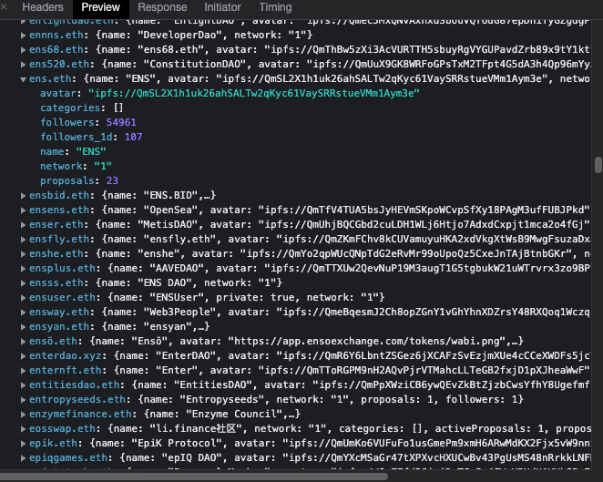

```typescript
////////////            API            ////////////
const request_dao_explore = fetch("https://hub.snapshot.org/api/explore", {
  "headers": {
    "accept": "*/*",
    "accept-language": "zh-CN,zh;q=0.9,en-US;q=0.8,en;q=0.7,zh-TW;q=0.6",
    "if-none-match": "W/\"12307e-JEokxEbLJg9WZMP1q+Cy829sOds\"",
    "sec-ch-ua": "\" Not A;Brand\";v=\"99\", \"Chromium\";v=\"101\", \"Google Chrome\";v=\"101\"",
    "sec-ch-ua-mobile": "?1",
    "sec-ch-ua-platform": "\"Android\"",
    "sec-fetch-dest": "empty",
    "sec-fetch-mode": "cors",
    "sec-fetch-site": "same-site"
  },
  "referrer": "https://snapshot.org/",
  "referrerPolicy": "strict-origin-when-cross-origin",
  "body": null,
  "method": "GET",
  "mode": "cors",
  "credentials": "omit"
});

const respond_dao_explore = "看下图"
```



```typescript

////////////            Example            ////////////

const request_dao_explore_1 = fetch("https://hub.snapshot.org/api/explore", {
  "headers": {
    "accept": "*/*",
    "accept-language": "zh-CN,zh;q=0.9,en-US;q=0.8,en;q=0.7,zh-TW;q=0.6",
    "if-none-match": "W/\"12307e-JEokxEbLJg9WZMP1q+Cy829sOds\"",
    "sec-ch-ua": "\" Not A;Brand\";v=\"99\", \"Chromium\";v=\"101\", \"Google Chrome\";v=\"101\"",
    "sec-ch-ua-mobile": "?1",
    "sec-ch-ua-platform": "\"Android\"",
    "sec-fetch-dest": "empty",
    "sec-fetch-mode": "cors",
    "sec-fetch-site": "same-site"
  },
  "referrer": "https://snapshot.org/",
  "referrerPolicy": "strict-origin-when-cross-origin",
  "body": null,
  "method": "GET",
  "mode": "cors",
  "credentials": "omit"
});

const respond_dao_explore_1 = "看下图"
```


